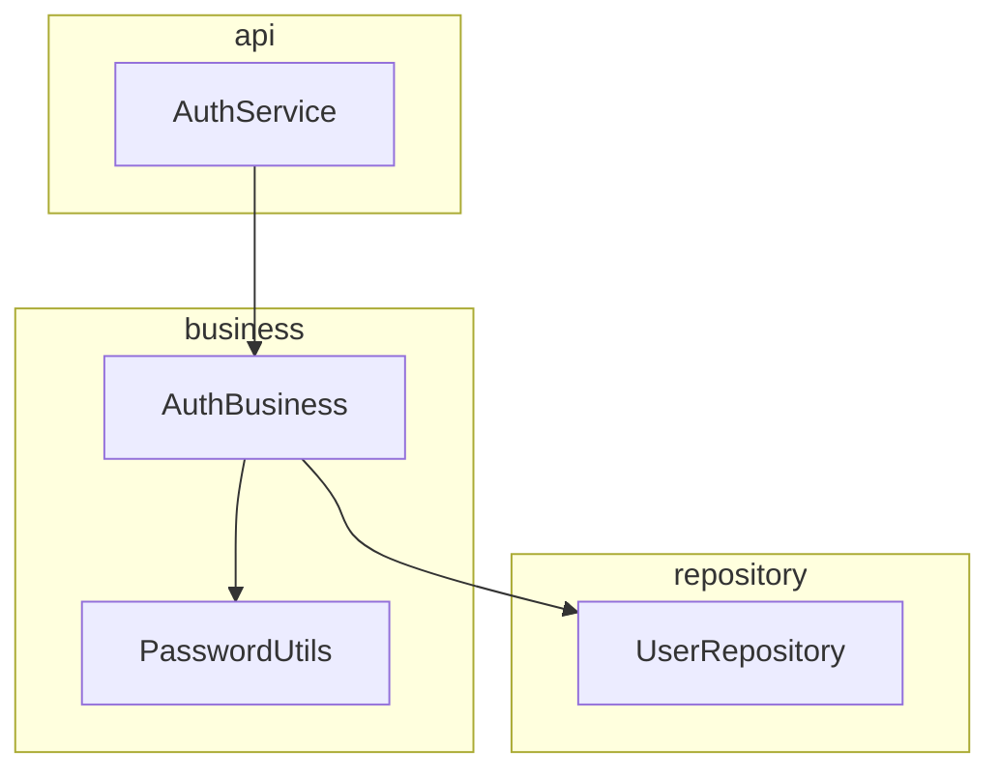
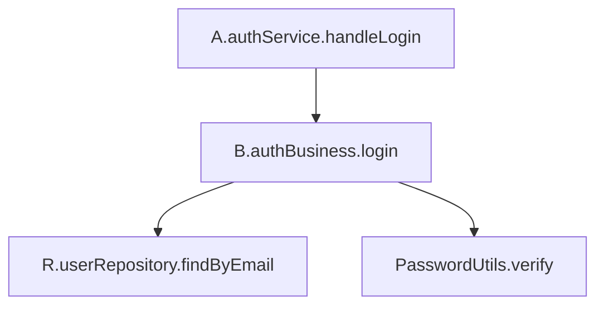
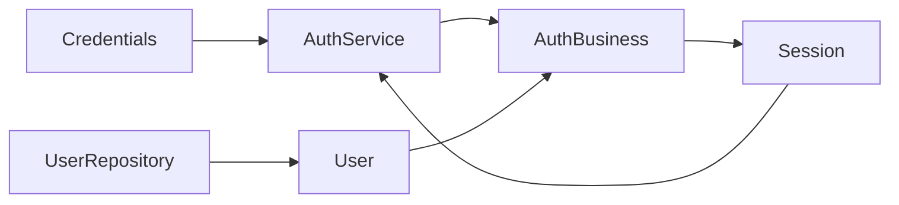

# XF Analyze — templates, checklists & worked example

Concrete output shapes for the `xf-analyze` pipeline. Fill these in; keep IDs
stable (they are the spine of the traceability matrix). For the model's intent
behind the design choices, read `../../_shared/foundations.md`.

---

## 1. SRS — Software Requirements Specification

Structure (ISO/IEC/IEEE 29148, trimmed to what a build needs):

```markdown
# SRS — <system>

## 1. Purpose & scope
What the system does, who uses it, what is explicitly out of scope.

## 2. Glossary (ubiquitous language)
<term> — <definition>.   (these become Transfer / component names)

## 3. Functional requirements
(one row per atomic requirement)

## 4. Non-functional requirements
(one row per measurable quality / constraint)

## 5. Open questions & assumptions
- Q1: <ambiguity to resolve with the stakeholder>
- A1: <assumption made to proceed, and why>
```

**Functional requirement row**

| Field | Example |
|---|---|
| ID | `FR-3` |
| Statement | The system authenticates a user from email + password and issues a session token. |
| Source | Spec §2.1 / stakeholder |
| Priority | Must / Should / Could |
| Acceptance criteria | **Given** a registered email and correct password **when** login is called **then** a non-expired session token is returned; **given** a wrong password **then** an authentication error is returned and no token issued. |

A requirement you cannot write an acceptance criterion for is not yet a
requirement — split it or send it back as an open question.

**Non-functional requirement row**

| Field | Example |
|---|---|
| ID | `NFR-2` |
| Category | Security |
| Statement (measurable) | Passwords are stored only as salted hashes; credential verification is constant-time; ≥ 5 failed logins / 10 min throttles the account. |
| Verification | code review + a timing test + a rate-limit test |
| Drives | `ADR-2` (hashing), a `ThrottledBusiness` generalization |

---

## 2. ADR — Architecture Decision Record (Nygard)

Write an ADR **only for a decision XF leaves open** (artefact boundaries;
technology/library per Access component; a generalization policy; where an
ambiguous domain rule lives; an NFR trade-off; a data store; cross-artefact
composition). **Do not** write ADRs for the layering, the R/B/A injection
pattern, the lifecycle, or the nomenclature — XF prescribes those.

```markdown
# ADR-<n>: <short title>

- **Status:** proposed | accepted | superseded by ADR-<m>
- **Date:** <YYYY-MM-DD>
- **Drivers:** <FR/NFR IDs that force this decision>

## Context
The forces at play: the requirement, the constraint, the options' tension.

## Decision
The choice, stated in one sentence.

## Consequences
What becomes easier, what becomes harder, what is now constrained.
In XF terms: which component/layer encapsulates this (e.g. "confined to the
Access component `IdentityRepository`; upper layers stay agnostic").

## Alternatives considered
Option B — why not. Option C — why not.
```

---

## 3. Traceability matrix

The spine of the analysis: it proves coverage and powers change-impact. Keep it
bidirectional — read it left-to-right for "is this requirement built?" and
right-to-left for "why does this operation exist?".

| Req | Artefact | Component (cell) | Operation | Acceptance criterion / Test |
|---|---|---|---|---|
| `FR-3` | auth | `AuthBusiness` (Business·Logical) | `login` | AC-3.1 → `test_login_ok`, AC-3.2 → `test_login_bad_password` |
| `FR-3` | auth | `UserRepository` (Access·Logical) | `findByEmail` | (covered transitively by AC-3.x) |
| `NFR-2` | auth | `PasswordUtils` (Business·Utility) | `verify` | timing test `test_verify_constant_time` |
| `NFR-2` | auth | `ThrottledBusiness` (Business·Generalization) | — | `test_throttle_after_5` |

**Checks to run and report:**

- **Coverage** — every `FR-n` appears in ≥1 row with an operation. Uncovered: _____
- **Orphans** — every operation in the design appears in ≥1 row. Orphan ops: _____
- **NFR homing** — every `NFR-n` maps to an ADR, a generalization/policy, a
  library, or an operation constraint. Unhomed NFRs: _____

---

## 4. Graphs (Mermaid)

### 4.1 Component dependency graph — must be a strictly-descending DAG



### 4.2 Operation call graph — yields the bottom-up build order



### 4.3 Data-flow graph — which Transfers cross which boundary



A cycle or an upward edge in 4.1 / 4.2 is a design defect — resolve it before
Phase 7 passes.

---

## 5. Verification report (Phase 7)

```markdown
## Design verification — <system>

**Traceability:** FRs covered _/_  ·  orphan operations: _  ·  NFRs homed _/_
**Structural conformance of the design (XF rule groups):**
- G1 folders/naming: OK / findings
- G2 layer isolation (dependency graph is a descending DAG): OK / findings
- G3–G7 component shapes (logical/general/injection/utility/transfer): OK / findings
**Consistency:** cycles: none / list  ·  dangling delegations: none / list
**Target conformance:** Λ=3 by construction; Λ=4 after semantic review.
**Blockers:** <must be empty to proceed to implementation>
```

Once anything is scaffolded, confirm for real:

```bash
npx @xfcfam/tools validate <artefact-root>
```

---

## 6. Definition of done (per phase)

| Phase | Done when |
|---|---|
| 0 Intake | scope stated, glossary drafted, missing inputs requested |
| 1 SRS | every requirement atomic, IDed, verifiable, with acceptance criteria |
| 2 ADRs | every open decision recorded, each citing its driver; none restating XF |
| 3 Artefacts | spec partitioned; every FR owned by exactly one artefact |
| 4 Matrix | total L×T classification per artefact; dependencies descend |
| 5 Ops + trace | operations specified; coverage / orphan / NFR-homing reported |
| 6 Graphs | dependency & call graphs acyclic & descending; build order derived |
| 7 Verify | design conformance clean or blockers logged |
| 8 Tests | every acceptance criterion mapped to ≥1 test |
| 9 Handoff | deliverables written; task list + open questions presented |

---

## 7. Worked example (compact, end to end)

**Input spec (excerpt):** *"Users log in with email + password and receive a
session token; wrong credentials are rejected. Passwords must never be stored in
clear; repeated failed logins must be throttled."*

**Phase 1 — SRS**

- `FR-1` Authenticate a user from email+password, issue a session token (AC: ok → token; bad → error, no token).
- `FR-2` Reject login when credentials are invalid (AC: wrong password → `InvalidCredentialsException`).
- `NFR-1` (Security) Passwords stored only as salted hashes; verification constant-time.
- `NFR-2` (Security) ≥5 failed logins / 10 min throttles further attempts.

**Phase 2 — ADRs**

- `ADR-1` *Identity store = PostgreSQL via `@xfcfam/xf-sql-postgres`* — drivers: FR-1. Confined to the Access component; upper layers stay agnostic.
- `ADR-2` *Password hashing = Argon2id* — drivers: NFR-1. Encapsulated in `PasswordUtils`.
- `ADR-3` *Throttling as a Business generalization* — drivers: NFR-2. (Not an Access concern; lives where the domain rule lives.)

**Phase 3 — Artefacts**

One artefact, `auth` (a single complete process: authenticate → issue session).
A larger spec ("…and an admin dashboard that reads audit logs") would split into
a second artefact, e.g. `audit`, composed via the ecosystem.

**Phase 4 — L×T matrix + data model (artefact `auth`)**

| Component | Layer · Type | Name | Folder |
|---|---|---|---|
| Users store | Access·Logical | `UserRepository` | `repository/logic/remote/` |
| Raw user record | Access·Transfer | `User` | `repository/transfers/` |
| Credential check + session mint | Business·Logical | `AuthBusiness` | `business/logic/instance/` |
| Throttle policy | Business·Generalization | `ThrottledBusiness` | `business/general/` |
| Hashing helper | Business·Utility | `PasswordUtils` | `business/utils/` |
| Issued session | Business·Transfer | `Session` | `business/transfers/` |
| Invalid creds | Business·Transfer (Exception) | `InvalidCredentialsException` | `business/transfers/` |
| Login endpoint | Interaction·Logical | `AuthService` | `api/logic/service/` |
| Login input | Interaction·Transfer | `Credentials` | `api/transfers/` |

**Phase 5 — operations + traceability**

| Component | Operation | Signature | Delegates to | Req |
|---|---|---|---|---|
| `UserRepository` | `findByEmail` | `findByEmail(email: string) -> User \| null` | — | FR-1 |
| `PasswordUtils` | `verify` | `verify(plain: string, hash: string) -> boolean` | — | NFR-1 |
| `AuthBusiness` | `login` | `login(c: Credentials) -> Session` *(throws `InvalidCredentialsException`)* | `R.userRepository.findByEmail`, `PasswordUtils.verify` | FR-1, FR-2 |
| `AuthService` | `handleLogin` | `handleLogin(req) -> response` | `B.authBusiness.login` | FR-1 |

Coverage: FR-1, FR-2, NFR-1, NFR-2 all reach an operation/policy ✓ · orphans: none ✓ · NFR homing: NFR-1→`PasswordUtils`+ADR-2, NFR-2→`ThrottledBusiness`+ADR-3 ✓

**Phase 6 — graphs:** as in §4 (descending DAG ✓, build order: `findByEmail`,
`verify` → `login` → `handleLogin`).

**Phase 7 — verify:** total classification ✓, descending DAG ✓, canonical names
✓, one R/B/A ✓ → design targets **Λ=3**; blockers: none.

**Phase 8 — test plan**

| Cell | Test | Mocks |
|---|---|---|
| Business·Logical `AuthBusiness.login` | isolation unit (AC-1, AC-2) | `R` |
| Business·Utility `PasswordUtils.verify` | pure + timing test (NFR-1) | none |
| Interaction·Logical `AuthService` | isolation unit | `B` |
| Access·Logical `UserRepository` | contract/integration | the DB |

**Phase 9 — task list (bottom-up):** `User` → `UserRepository.findByEmail` →
`PasswordUtils.verify` → `Session`/`InvalidCredentialsException` →
`ThrottledBusiness` → `AuthBusiness.login` → `Credentials` →
`AuthService.handleLogin` → wire R/B/A + lifecycle. Hand to `xf-implement`.
