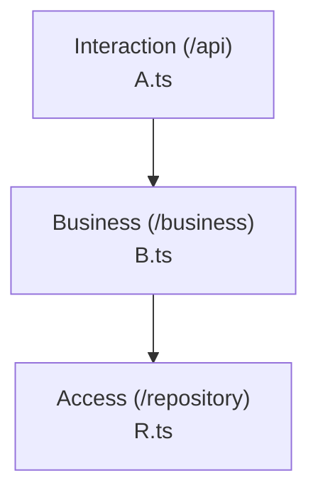
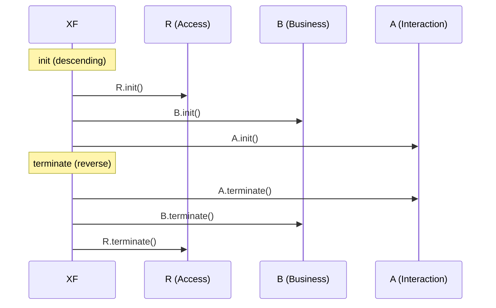

# XF Documentation — Templates

Concrete output shapes for the `xf-document` skill: per-component docstrings,
a ready-to-paste README architecture section, and optional Mermaid diagrams.
All examples are language-agnostic in intent; the TypeScript versions are the
reference because xftools parses TypeScript fully (see
`../../_shared/catalogue.md` § "Languages").

For the canonical layout and the rule catalog, read
`../../_shared/catalogue.md` and `../../_shared/rules-detail.md`.

---

## Per-component docstrings

A model-aligned docstring records three facts the model cares about: the L×T
cell, the canonical access path, and the one-line responsibility. Everything
else is ordinary API documentation.

### Logical (Business) — TSDoc

```typescript
/**
 * XF: (Business, Logical) — domain logic for user sessions.
 * Access: `B.session.refresh()` (never instantiated directly).
 * Depends downward on Access via `R` only.
 */
export class SessionBusiness extends StatelessBusiness {
  async init() {}
  async terminate() {}

  /** Refresh the active session against the Access layer. */
  async refresh(): Promise<Session> {
    return R.sessionRepository.renew()
  }
}
```

### Injection — TSDoc

```typescript
/**
 * XF: (Business, Injection) — the Business access conduit.
 * Exposes every Business logical as a static slot; init/terminate wire the
 * layer lifecycle. Reached only by XF (or the entry point) — never by a
 * sibling component.
 */
export class B {
  private constructor() {}
  static readonly userBusiness = new UserBusiness()
  static readonly session      = new SessionBusiness()
  /* ... */
}
```

### Transfer — TSDoc

```typescript
/**
 * XF: (Business, Transfer) — data crossing the Business↔Access boundary.
 * May carry self-contained operations on its own data; anything that
 * orchestrates a component or models a process lives in a Logical.
 */
export interface Session {
  id: string
  userId: string
  expiresAt: number
}
```

### Language-agnostic docstring skeleton

For any language, the docstring header reduces to:

```
XF: (<Layer>, <Type>[ / <Service|View>]) — <one-line responsibility>.
Access: <injection>.<component>.<operation>()   (logicals only)
Depends downward on: <lower layer or "nothing inside the artefact">
```

---

## README architecture section (paste-ready)

```markdown
## Architecture (XF / CFAM)

This artefact follows the **XF Architecture Model (CFAM)**: a closed L×T
matrix of 3 layers × 5 types. Dependencies run strictly downward
(Interaction → Business → Access); logicals are reached only through their
layer injection (`R` / `B` / `A`).

**Artefact root:** `./src` · **Conformance:** `Λ=_` (run `xftools validate ./`)

### Component catalog

#### Access layer (`/repository`)

| Component | Type | Canonical name | Path | Responsibility |
| --- | --- | --- | --- | --- |
| … | Logical | `UserRepository` | `repository/logic/remote/UserRepository.ts` | … |
| … | Injection | `R` | `repository/R.ts` | Exposes & wires Access logicals |

#### Business layer (`/business`)

| Component | Type | Canonical name | Path | Responsibility |
| --- | --- | --- | --- | --- |
| … | Logical | `SessionBusiness` | `business/logic/instance/SessionBusiness.ts` | … |
| … | Injection | `B` | `business/B.ts` | Exposes & wires Business logicals |

#### Interaction layer (`/api`)

| Component | Type | Canonical name | Path | Responsibility |
| --- | --- | --- | --- | --- |
| … | Logical / Service | `UserService` | `api/logic/service/UserService.ts` | … |
| … | Injection | `A` | `api/A.ts` | Exposes & wires Interaction logicals |

### Injection map

| Injection | Layer | Exposes | Canonical access |
| --- | --- | --- | --- |
| `R` | Access | `userRepository`, … | `R.userRepository.fetch(id)` |
| `B` | Business | `session`, … | `B.session.refresh()` |
| `A` | Interaction | `userService`, … | `A.userService.handle(req)` |

Lifecycle: `R.init() → B.init() → A.init()`, terminated in reverse. The
optional `XF` element wraps this: `XF.init() = R.init(); B.init(); A.init()`.

### Dependency direction

Interaction → Business → Access (descending only; never upward or lateral).
Transfers (`User`, `Session`, …) are the data that flows across boundaries.

> This section describes structure that is self-evident from the canonical
> folders. Regenerate it whenever the structure changes and keep `Λ` in sync
> with `xftools validate`.
```

---

## Optional Mermaid diagrams

### Layer-dependency view



### Injection / lifecycle view



Keep diagrams optional and secondary to the Markdown tables — the tables are
the canonical, diffable record; the diagrams are a convenience view.
